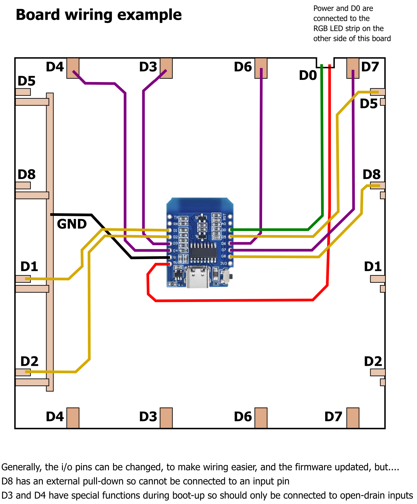

# tcp_client_4x4
### Firmware for NodeMCU/Wemos D1 mini

This firmware is for an ESP8266-based controller, such as NodeMCU or Wemos D1 mini.
It has a string of RGB LEDs (WS2812B neopixel-type LEDs) connected in a "snake-like" fashion (the LEDs are taken from a single strip of 30-per-metre) and arranged in four vertical columns of 4 LEDs.

### RGB LEDs (snake pattern)
The LEDs are numbered 0-3 from top-left to bottom-left, (in a downwards direction) then 4-7, up from bottom-left-centre to top-left-centre (upwards) then 8-11, downwards from top-right-centre to bottom-right-centre, finally 12-15, upwards from bottom-right to top-right.

### Hall sensor array
An array of hall sensors are multiplexed into four rows of four and when the state of a sensor changes (a magnet is placed on top or removed from over the sensor) as message is sent to the host device/server
Calibration is included to allow you to rotate the grid of 4x4 sensors in any of four different orientations.
(while in calibration mode, the corner squares will flash - simply activate the sensor you wish to be at the top-left 0,0 position)

### Auto-connecting
When the device starts up, it connects to your home router
After connecting, it broadcasts its presence across the network, on address 255.255.255.255
The server is expected to listen out for this message and respond to it
When the device receives a response, it stops "shouting" across UDP and connects to the server over TCP (for robust, reliable two-way communications with the server)

### Access point (AP) mode
If the device cannot connect to your home network, it will set itself up in access point (AP) mode.
Connect your smartphone/table to the wifi network created by the device and navigate to web address 10.0.0.1
Enter your home router SSID and password into the web form (and enter a unique "device id" in hex format) before resetting the device.
On reset, the device should connect to your home router and automatically try to connect to the host/server.

### Message format(s)
You can control the LEDs on the device by sending a message, with values encoded into hexadecimal, in the form

U - square number - flags - colour

Where U is the message type (u for "update")
The square number is a single character representing a hexadecimal value from 0-F
Flags is a hex character representing a 4-bit flag, using bitmasking to indicate
B1000 = the square should flash
B0100 = the square should be at half brightness
(two other unused bits remain for future development)
Colour is a hex character representing a value from 0-15, which is the "colour index" to change the LED to

- 0 = black/off
- 1 = red
- 2 = green
- 3 = blue
- 4 = yellow
- 5 = magenta
- 6 = cyan
- 7 = pink
- 8 = grey
- 9 = white
- 15 = full white

Update applies to only a single square - all other LEDs retain their previous colours/values.

Other message types include

W - write a colour to a square; this is like update (above) but clears all other LEDs (sets them to black/off) before setting the colour of the single square.

T - shorthand to write a "stream" of LED colours; each following character is a hex value of the colour index to set the next LED in the "chain" (so T1234 would set LED0 to colour 1 (red) and LED1 to colour 2 (green) and LED2 to blue and LED3 to yellow)

C - puts the device into "calibrate" mode - allowing the user to select which of the corner squares should be 0,0 or "top-left".

X - simply turns off all the LEDs

Q - queries the state of the hall sensor array.
The response (to the server) is Q followed by hexadecimal characters representing any square that has its sensor currently activated.
So if a magnet were over squares 2, 3, 7 and 10 the response would be Q237A

F - when a square is set to flash, all flashing squares share the same "timer" that turns them on and off.
Follow this command with a one- or two-character hexadecimal value, indicating the number of tenths of a second the flash-delay should last
(so, for example, to set the flash duration to half a second, you would send F5)

